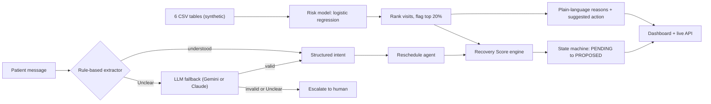

# AI Care Operations Copilot

**An AI copilot for home-healthcare coordinators: predict which visits will fail, read patient messages in English / Hindi / Hinglish, and propose a specific recovery, with a human approving.**

> **Portfolio project (product + AI-product case study).** The problem was shaped through real conversations with city coordinators, nurses, and operations stakeholders in a home-healthcare setting. All data and outcomes used in the project are synthetic/simulated and are intended to demonstrate problem framing, trade-off decisions and AI-product judgment, not production-grade engineering or validated real-world results.

**Live demo:** https://careops-live-demo.onrender.com/a

<!-- Add a screenshot or GIF: docs/screenshot.png -->

---

## TL;DR

|                    |                                                                                                                                                                                                                                                    |
| ------------------ | -------------------------------------------------------------------------------------------------------------------------------------------------------------------------------------------------------------------------------------------------- |
| **Problem**        | In India's home-care market, visits get disrupted by no-shows, cancellations, late providers and delay cascades. Coordinators fix them by phone, one call at a time. In this simulated data, **25.7%** of visits were disrupted in the test month. |
| **User**           | The operations coordinator, who has limited hours and must decide which visits to chase. Patients, families and providers (many of them gig or contractual) are the secondary users.                                                               |
| **Solution**       | Rank the day's visits by risk and explain why. Read each patient message into structured data. Recommend and propose a specific new provider or date. A human approves.                                                                            |
| **Autonomy level** | Human-in-the-loop. The AI recommends; the coordinator approves. Anything the system cannot read goes to a human.                                                                                                                                   |

## How I found the problem

CareOps was shaped through conversations with city coordinators, nurses, and operations stakeholders in a home-healthcare setting. These conversations helped me understand how visit disruptions are handled today, how coordinators decide which visits need attention first, what makes patient messages and rescheduling difficult, why finding a suitable replacement provider is hard, and the operational constraints around provider availability, specialization, location and continuity of care. These insights informed the core workflow of the product: prioritize the day's visits, interpret patient messages, and find a suitable replacement or new slot.

* **User discovery:** Real conversations with city coordinators, nurses and operations stakeholders in a home-healthcare setting.
* **Data and evaluation:** Synthetic data and simulated outcomes. Real patient and operational data cannot be shared publicly, so model evaluation and end-to-end testing run on synthetic data. There are no production, adoption or real-world outcome results.

## Key findings

| # | Finding                                                                                                                                                                           | Why it matters                                                                                                                                                                                                           |
| - | --------------------------------------------------------------------------------------------------------------------------------------------------------------------------------- | ------------------------------------------------------------------------------------------------------------------------------------------------------------------------------------------------------------------------ |
| 1 | **Fixing data leakage lowered ROC-AUC from 0.658 to 0.58.** Features were using no-show counts from the future.                                                                   | Reported the honest number. The model is a triage aid (33.6% precision in the top 20% vs a 25.7% base rate, about 1.3x lift), not an autonomous decision-maker.                                                          |
| 2 | **Rules alone: 44.7% intent accuracy on 103 unseen messages**, despite 100% agreement with their own training labels.                                                             | A 100% score on your own templates says nothing about generalization.                                                                                                                                                    |
| 3 | **Rule-first hybrid: 97.1% intent accuracy (offline eval), with the LLM called on only 65% of messages.** 12.6% are escalated to a human instead of guessed.                      | Use the LLM only where it earns its cost. The 100% LLM result is a blind offline evaluation, not a production benchmark, and cost/latency were not measured.                                                             |
| 4 | **77% of at-risk visits (164 of 212 true disruptions) had no eligible backup provider.**                                                                                          | The bottleneck is provider capacity, not patient willingness. A case-by-case simulation recovers **16** visits, versus **74** from the flat "success rate" formula, and flips modeled net value from +33,970 to -12,850. |
| 5 | **Breakeven intervention success rate is about 14.9%.**                                                                                                                           | A testable claim, which is what the proposed experiment ([EXPERIMENT_DESIGN.md](EXPERIMENT_DESIGN.md)) would measure.                                                                                                    |
| 6 | **A fairness claim was reversed by a proper subgroup check.** First-time patients are flagged *less* often, but the model is overconfident on them (+8.6 points calibration gap). | Corrected the README instead of defending it.                                                                                                                                                                            |
| 7 | **Stage 2 model (No-Show vs Cancelled) is essentially chance (AUC 0.521).**                                                                                                       | Published as a negative result, so no feature is built on it.                                                                                                                                                            |

## How it works



### Modules

| Module                | What it does                                                                                                                                                                                     | File                                                                                       |
| --------------------- | ------------------------------------------------------------------------------------------------------------------------------------------------------------------------------------------------ | ------------------------------------------------------------------------------------------ |
| Risk model            | Predicts disruption per visit using six leakage-free features, with a time-based split (train Jun–Jul, test Aug) and rank-based tiers (top 10% High, next 10% Medium)                            | `model/disruption_model.py`                                                                |
| Fairness and Stage 2  | First-time vs returning patient subgroup check; No-Show vs Cancelled diagnostic                                                                                                                  | `model/fairness_subgroup_analysis.py`, `model/disruption_type_model.py`                    |
| Message understanding | Rule-based extractor, LLM eval on 103 held-out messages, and the rule-first hybrid with human escalation                                                                                         | `model/communication_intelligence.py`, `model/hybrid_extraction.py`, `model/gemini_llm.py` |
| Recovery Score        | Hard eligibility filter (area, availability, capacity, service fit) plus a weighted score: continuity 25, proximity 25, capacity 15, schedule fit 15, service fit 5, minus a utilization penalty | `model/capacity_recovery.py`                                                               |
| Reschedule agent      | Understand, check availability, propose a specific provider and date, driven by an enforced state machine                                                                                        | `model/reschedule_agent.py`, `model/agent_state_machine.py`                                |
| Cascade detection     | One rule: a visit is a cascade risk when its delay used at least 85% of its slot's buffer                                                                                                        | `model/generate_dashboard_data.py`                                                         |
| Economics             | Sensitivity sweeps, breakeven rate, and a case-by-case outcome simulation                                                                                                                        | `model/economics_simulation.py`, `model/intervention_outcome_simulation.py`                |
| Live app              | FastAPI backend plus a coordinator dashboard                                                                                                                                                     | `main.py`, `dashboard/index.html`                                                          |

## Run it

**Offline pipeline** (trains the models, runs the evals, regenerates the dashboard data):

```bash
python run.py
```

Alternatives: `./run.sh` (macOS / Linux / Git Bash / WSL) or `.\run.ps1` (Windows PowerShell). Add `--no-install` to skip the pip step. Then open `dashboard/index.html` for the static risk and cascade views.

**Live demo locally** (needed for the "Try the AI" tab):

```bash
pip install -r requirements.txt
uvicorn main:app --reload
```

Open http://127.0.0.1:8000.

**Optional LLM fallback.** Copy `.env.example` and set `GEMINI_API_KEY` (free key from [aistudio.google.com/apikey](https://aistudio.google.com/apikey)) or `ANTHROPIC_API_KEY`. Without a key the app still works on rules alone, and ambiguous messages come back with `escalate_to_human: true`. **Never commit a real key.** `.env` is git-ignored.

**Deploy free on Render:** push to GitHub, create a Blueprint from the repo (it reads `render.yaml`), and add `GEMINI_API_KEY` as an environment variable.

**API endpoints:** `GET /health`, `GET /api/operations`, `POST /api/analyze`, `POST /api/recover`, `POST /api/reschedule`.

## Repository layout

```text
main.py                     FastAPI live-demo server
run.py / run.sh / run.ps1   one-command pipeline
render.yaml                 Render deployment config
requirements.txt            dependencies
data/                       6 synthetic tables + 103-message eval set
model/                      risk model, message understanding, recovery engine, agent, economics
dashboard/index.html         coordinator UI
docs/TECHNICAL_NOTES.md     full technical write-up (every module, bug, and eval caveat)
EXPERIMENT_DESIGN.md        the randomized trial that would replace placeholder assumptions
```

The synthetic data covers 5 Indian cities, 20 providers, 2,000 patients and 10,000 appointments.

## Honest limitations

* **All data is synthetic and outcomes are simulated.** Real patient and operational data cannot be shared publicly, so evaluation and end-to-end testing use synthetic data. The problem framing was informed by conversations with city coordinators, nurses and operations stakeholders, but there are no real-world outcome, adoption or satisfaction results.
* **The risk model is modest** (ROC-AUC about 0.58). It is a triage signal, and it is noisy on any single day.
* **Economics are a simulation** with placeholder inputs (35% intervention success rate, revenue per visit, coordinator cost). No intervention was run.
* **The 100% LLM number is a blind offline evaluation.** Cost, latency and reliability of the live LLM call are unmeasured.
* **The demo takes no real actions.** There is no real WhatsApp or scheduling-system write; "Simulate approval" changes local UI state only, and the state machine stops at PROPOSED because there is no reply channel.
* **Availability beyond Aug 29 is generated**, not observed.

Full detail on each of these, including the bugs found and fixed along the way, is in [docs/TECHNICAL_NOTES.md](docs/TECHNICAL_NOTES.md).

## What I would do next

1. **Validate the discovered workflow through structured follow-ups**, such as shadowing coordinators and running a formal interview round, to test remaining assumptions like the 20% coordinator bandwidth and economics inputs.
2. **Replace the capacity gap with real availability data**, since supply was the bottleneck.
3. **Run the experiment** in [EXPERIMENT_DESIGN.md](EXPERIMENT_DESIGN.md): about 850 appointments per arm, appointment-level randomization, with coordinator time and patient opt-outs as guardrails.
4. **Measure the LLM fallback** on a metered run (cost, latency, reliability) and add privacy handling for patient messages.
5. **Add a real reply channel** so the state machine can move past PROPOSED.

## Author

Ritika Jaiswal  https://www.linkedin.com/in/ritika-jaiswal-83661a252/
